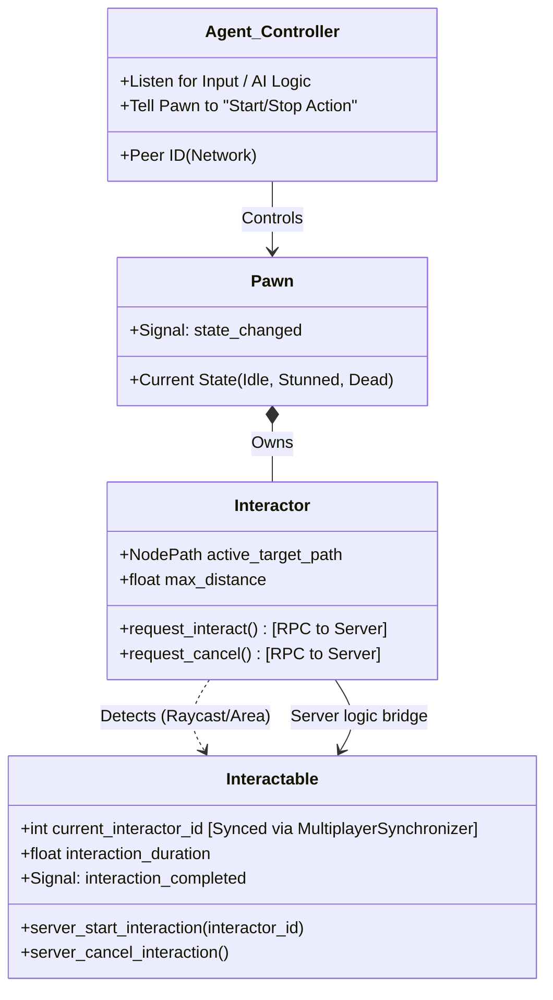
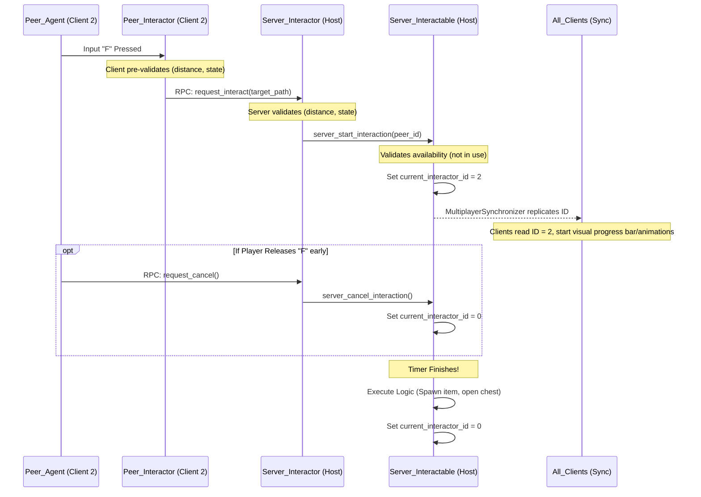
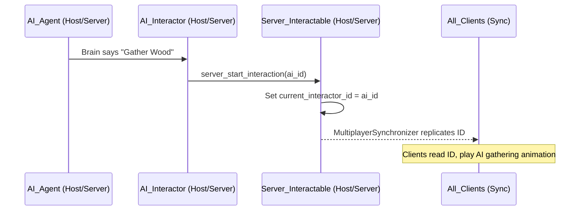

Crucial Godot Tip: Always use get_path() or network-synced Instance IDs to pass the target_id over RPCs, so the server knows exactly which node the client is trying to interact with.

## Handling UI Interactions (Crafting & Chests)
UI should be strictly decoupled from the game logic. The server doesn't care about your UI panels; it only cares about data.

Opening a Chest: Player interacts -> Server validates -> Server adds the Player to the chest's "active viewers" list -> Server sends RPC open_chest_ui(chest_inventory_data) to that specific client.

Moving an Item: The player drags an item in the UI. The Client sends rpc_id(1, "request_move_item", from_slot, to_slot). The Server checks if the slots are valid, updates its authoritative inventory arrays, and sends a state update RPC back to all "active viewers" of that chest.

Closing the Chest: Client closes the UI and sends an RPC. The Server removes them from the viewers list.

## Managing Players vs. AI vs. Remote Peers
This is where the Component architecture shines. The Interactable object (the tree, the chest) should not care who is interacting with it, only that an Interactor triggered it.

The Local Player (You): Reads OS input (keyboard/mouse). Tells the local Interactor to fire an RPC to the Server.

The AI: The AI's brain only runs on the Server. When the AI wants to open a door, its logic script tells its Interactor to interact. Because it's already on the server, it directly calls the interaction function, bypassing the network RPC entirely.

Remote Peers (Other Players): They do absolutely nothing regarding interaction logic. Your client merely receives state updates from the server (e.g., "Player 2 is playing the mining animation" or "The tree is gone"). They don't have active Interactors on your machine.

### 1. Component Architecture (The "Clean Interface")

To keep things strictly decoupled, components should only communicate via explicit method calls downwards, and signals upwards.

### 2. The Network Flow (End-to-End)

Here is how the data moves depending on *who* is driving the interaction.

#### Scenario A: Remote Peer (Player 2)

This is the longest round-trip and the primary flow you design around.

#### Scenario B: The Host Player

Because the Host is the Server, RPCs sent by the Host player's client execute immediately on the same machine. Godot's `rpc_id(1, ...)` handles this elegantly; if the Host calls it, it bypasses the network and triggers locally. The flow is identical to Scenario A, just with zero latency.

#### Scenario C: Host AI

This is where the decoupled architecture pays off. The AI doesn't need RPCs.

---

### 3. The Final "Edge Cases" to Watch For

Given this specific setup, here are the serious edge cases you must account for to ensure robustness:

**1. UI Input Focus Stealing (The "NO GRAB" trap)**
When an interaction opens a UI element (like a chest inventory or crafting menu), Godot's `Control` nodes can easily consume input events. If your UI grabs focus, your `Agent` might suddenly stop receiving `Input.is_action_just_released("interact")` or movement commands.

* *Solution:* Explicitly manage `mouse_filter` and `focus_mode` on your UI elements. Ensure gameplay inputs bypass UI focus when necessary, or have the UI expressly signal the Controller when it closes.

**2. The "Double Tap" State Desync**
If a client has high ping, they might press `F`, see nothing happen immediately, and press `F` again before the server processes the first request. The client might send `request_interact` followed closely by `request_cancel`.

* *Solution:* The Server's `Interactor` must track what it is currently doing. If it receives a `request_interact` while it is already processing one for that same target, it must quietly drop the duplicate request.

**3. The Server Silent Fail (Client Soft-Lock)**
If a client starts a local progress bar assuming the server will approve the interaction, but the server rejects it (e.g., target just ran out of resources), the client's progress bar will stay stuck on screen forever unless told otherwise.

* *Solution:* Do not rely entirely on the `MultiplayerSynchronizer` to clear client states. If the server rejects an interaction request, it should fire a targeted RPC back to that specific client: `rpc_id(peer_id, "interaction_rejected")`. The client uses this to immediately clear local caches and hide the UI.

**4. The Continuous Hold "Chain" Interaction**
If a player holds `F` to harvest a small bush, the bush depletes and is destroyed. If the player is *still* holding `F`, and another bush happens to be in range, do they immediately start harvesting it?

* *Solution:* The `Agent` should usually rely on `Input.is_action_just_pressed("interact")` to start the sequence, requiring the player to release and press again for a new object, preventing accidental chaining.
